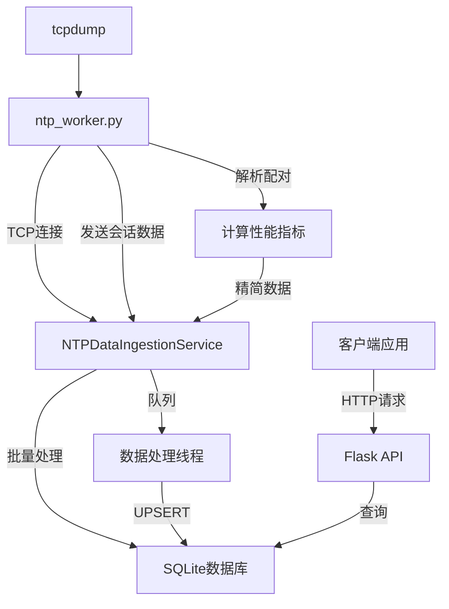

# Flask 应用集成历史 NTP 客户端查询功能 - 完整实现指南

## 📋 项目概述

本次集成为现有的Flask网络管理应用添加了历史NTP客户端查询功能，通过优化的架构设计实现零中间文件写入，大幅减少磁盘占用。核心特性包括：

- **零磁盘中间文件**: ntp_worker.py通过TCP直接发送数据到处理服务
- **集中式数据处理**: 所有NTP会话数据通过内存传输，统一存储到SQLite数据库
- **批量优化写入**: 减少数据库I/O操作，提高性能
- **完整的API接口**: 提供分页查询、搜索、导出等功能

## 🆕 新创建的文件

### 1. `ntp_worker.py` (重构)
**原文件**: `ntp_packet_analyzer.py` → **新文件**: `ntp_worker.py`

**主要变化**:
- ✅ 移除进程管理逻辑，专注数据包分析
- ✅ 新增TCP客户端功能，实时发送会话数据
- ✅ 在worker内部计算性能指标（延迟、处理时间）
- ✅ 移除本地会话数据持久化，仅保留摘要信息
- ✅ 使用logging替代print输出

**新增参数**:
```bash
--ingestion-host 127.0.0.1  # 数据接收服务主机
--ingestion-port 10000      # 数据接收服务端口
```

### 2. `models/ntp_models.py` (新建)
**功能**: SQLAlchemy数据库模型定义

**核心模型**: `NTPClient`
```python
class NTPClient(Base):
    # 网络标识
    client_ip = Column(String(45), nullable=False, index=True)
    interface_name = Column(String(64), nullable=False, index=True)
    
    # NTP协议信息
    ntp_version = Column(Integer, nullable=False)
    stratum = Column(Integer, nullable=True)
    
    # 性能指标（预计算）
    client_to_server_latency_seconds = Column(Float, nullable=True)
    server_processing_time_seconds = Column(Float, nullable=True)
    total_process_time_seconds = Column(Float, nullable=True)
    
    # 时间管理
    first_seen_timestamp = Column(DateTime, nullable=False)
    last_seen_timestamp = Column(DateTime, nullable=False)
    session_count = Column(Integer, nullable=False, default=1)
```

### 3. `services/ntp_data_ingestion_service.py` (新建)
**功能**: TCP数据接收和数据库处理服务

**核心组件**:
- `ThreadedTCPServer`: 多线程TCP服务器
- `NTPDataRequestHandler`: 处理TCP连接和数据接收
- `NTPDataIngestionService`: 主服务类，管理数据处理和存储

**关键特性**:
- 🔄 多线程并发处理
- 📊 批量数据库写入（可配置批量大小和时间间隔）
- 🔍 基于client_ip的去重和更新逻辑
- 📈 完整的统计信息收集

### 4. `routes/ntp_history_routes.py` (新建)
**功能**: 历史NTP客户端查询API

**API端点**:
```
GET  /api/ntp/history/clients              # 分页查询客户端列表
GET  /api/ntp/history/clients/<client_ip>  # 获取特定客户端详情
GET  /api/ntp/history/interfaces/statistics # 网卡统计信息
GET  /api/ntp/history/service/statistics    # 服务统计信息
POST /api/ntp/history/search                # 高级搜索
POST /api/ntp/history/export                # 数据导出
POST /api/ntp/history/cleanup               # 清理旧记录
GET  /api/ntp/history/health                # 健康检查
```

## 🔧 修改的文件

### 5. `config.py` (更新)
**新增配置项**:
```python
# NTP历史数据库配置
NTP_DB_PATH = "data/ntp_clients.db"           # SQLite数据库路径
NTP_INGESTION_HOST = "127.0.0.1"             # TCP服务监听地址
NTP_INGESTION_PORT = 10000                    # TCP服务监听端口

# 批量处理配置
NTP_BATCH_SIZE = 100                          # 批量写入记录数
NTP_BATCH_INTERVAL_SECONDS = 5.0             # 批量写入时间间隔

# 删除配置项
# NTP_SESSION_DIR (已移除)
```

### 6. `services/ntp_monitor_service.py` (更新)
**主要变化**:
- ✅ 启动命令新增 `--ingestion-host` 和 `--ingestion-port` 参数
- ✅ 移除 `output_file` 参数传递（仅保留摘要输出）
- ✅ 状态信息中显示数据接收目标地址

### 7. `app.py` (更新)
**新增功能**:
- ✅ 数据库初始化 (`init_db()`)
- ✅ 启动NTP数据接收服务
- ✅ 注册 `ntp_history_bp` 蓝图
- ✅ 增强的健康检查，包含所有服务状态
- ✅ 优雅关闭处理，确保数据完整性

## 🚀 核心工作流程



## 📡 API 使用示例

### 启动网卡监控
```bash
curl -X POST http://localhost:8000/api/ntp/interfaces/eth0/start \
  -H "Content-Type: application/json" \
  -d '{"port": 123, "timeout": 2.0}'
```

### 查询历史客户端
```bash
# 分页查询
curl "http://localhost:8000/api/ntp/history/clients?page=1&page_size=10"

# 搜索特定IP
curl "http://localhost:8000/api/ntp/history/clients?search_ip=192.168.1.100"

# 筛选网卡
curl "http://localhost:8000/api/ntp/history/clients?interface_name=eth0"
```

### 获取客户端详情
```bash
curl "http://localhost:8000/api/ntp/history/clients/192.168.1.100"
```

### 网卡统计信息
```bash
curl "http://localhost:8000/api/ntp/history/interfaces/statistics"
```

### 高级搜索
```bash
curl -X POST http://localhost:8000/api/ntp/history/search \
  -H "Content-Type: application/json" \
  -d '{
    "filters": {
      "client_ips": ["192.168.1.100", "192.168.1.101"],
      "interface_names": ["eth0"]
    },
    "pagination": {"page": 1, "page_size": 20}
  }'
```

### 数据导出
```bash
curl -X POST http://localhost:8000/api/ntp/history/export \
  -H "Content-Type: application/json" \
  -d '{
    "format": "json",
    "limit": 1000,
    "filters": {"interface_name": "eth0"}
  }'
```

## 📊 数据库结构

### NTPClient表结构
```sql
CREATE TABLE ntp_clients (
    id INTEGER PRIMARY KEY AUTOINCREMENT,
    client_ip VARCHAR(45) NOT NULL,
    client_port INTEGER NOT NULL,
    server_ip VARCHAR(45) NOT NULL,
    server_port INTEGER DEFAULT 123,
    interface_name VARCHAR(64) NOT NULL,
    ntp_version INTEGER NOT NULL,
    stratum INTEGER,
    precision INTEGER,
    root_delay FLOAT,
    root_dispersion FLOAT,
    reference_id VARCHAR(32),
    leap_indicator VARCHAR(64),
    poll_interval INTEGER,
    reference_timestamp FLOAT,
    originate_timestamp FLOAT,
    receive_timestamp FLOAT,
    transmit_timestamp FLOAT,
    client_to_server_latency_seconds FLOAT,
    server_processing_time_seconds FLOAT,
    total_process_time_seconds FLOAT,
    packet_length INTEGER,
    session_timestamp DATETIME NOT NULL,
    first_seen_timestamp DATETIME NOT NULL,
    last_seen_timestamp DATETIME NOT NULL,
    session_count INTEGER DEFAULT 1,
    created_at DATETIME DEFAULT CURRENT_TIMESTAMP,
    updated_at DATETIME DEFAULT CURRENT_TIMESTAMP
);

-- 索引
CREATE INDEX idx_client_interface ON ntp_clients(client_ip, interface_name);
CREATE INDEX idx_last_seen ON ntp_clients(last_seen_timestamp);
CREATE INDEX idx_interface_last_seen ON ntp_clients(interface_name, last_seen_timestamp);
```

## ⚙️ 配置优化建议

### 生产环境配置
```python
# config.py 生产环境建议
NTP_PID_DIR = "/var/run/ntp_monitor/"         # 使用系统标准目录
NTP_DB_PATH = "/var/lib/ntp_monitor/clients.db"  # 持久化存储
NTP_INGESTION_PORT = 10000                    # 确保端口未被占用
NTP_BATCH_SIZE = 500                          # 高流量环境增大批量
NTP_BATCH_INTERVAL_SECONDS = 3.0             # 减少延迟
```

### 性能调优参数
```python
# 高流量环境
NTP_BATCH_SIZE = 1000
NTP_BATCH_INTERVAL_SECONDS = 2.0

# 低延迟要求
NTP_BATCH_SIZE = 50
NTP_BATCH_INTERVAL_SECONDS = 1.0

# 资源受限环境
NTP_BATCH_SIZE = 100
NTP_BATCH_INTERVAL_SECONDS = 10.0
```

## 🛡️ 部署注意事项

### 1. 权限要求
```bash
# tcpdump权限（必需）
sudo setcap cap_net_raw,cap_net_admin=eip /usr/sbin/tcpdump

# 目录权限
sudo mkdir -p /var/run/ntp_monitor /var/lib/ntp_monitor
sudo chown app_user:app_group /var/run/ntp_monitor /var/lib/ntp_monitor
```

### 2. 端口配置
- 确保 `NTP_INGESTION_PORT` (默认10000) 未被占用
- 防火墙配置允许内部TCP连接
- 如果运行多个实例，使用不同的端口

### 3. 依赖检查
```bash
pip install sqlalchemy psutil flask
which tcpdump  # 确保tcpdump可用
```

### 4. 系统资源监控
- 监控TCP连接数量（每个ntp_worker一个连接）
- 数据库文件大小增长
- 内存使用情况（批量处理队列）

## 🔍 故障排查

### 常见问题

#### 1. 数据接收服务启动失败
```bash
# 检查端口占用
netstat -tlnp | grep 10000

# 检查日志
tail -f /path/to/app.log
```

#### 2. ntp_worker连接失败
```bash
# 检查worker日志
tail -f /tmp/ntp_monitor/ntp_eth0.log

# 测试TCP连接
telnet 127.0.0.1 10000
```

#### 3. 数据库写入失败
```bash
# 检查数据库文件权限
ls -la /path/to/ntp_clients.db

# 检查SQLite
sqlite3 /path/to/ntp_clients.db ".tables"
```

#### 4. 性能问题
```python
# 查看服务统计
curl http://localhost:8000/api/ntp/history/service/statistics

# 检查队列大小
# 如果queue_size持续增长，考虑增大NTP_BATCH_SIZE
```

## 📈 监控指标

### 关键指标
- `total_received`: 接收的会话总数
- `total_processed`: 处理的会话总数  
- `queue_size`: 待处理队列大小
- `processing_errors`: 处理错误数
- `total_inserted`: 新插入的客户端数
- `total_updated`: 更新的客户端数

### 性能基准
- 正常情况下，`queue_size` 应保持在较低水平
- `processing_errors` 应该很少或为零
- 批量处理间隔应根据实际流量调整

## 🎯 功能特性总结

✅ **零磁盘中间文件**: 完全消除了session数据的本地写入  
✅ **实时数据传输**: TCP连接确保数据及时传输  
✅ **智能去重**: 基于client_ip自动更新记录  
✅ **批量优化**: 减少数据库I/O，提高性能  
✅ **完整API**: 分页、搜索、导出、统计等功能  
✅ **监控友好**: 丰富的统计信息和健康检查  
✅ **优雅关闭**: 确保数据完整性  
✅ **可扩展性**: 支持多网卡并发监控  

这个集成方案成功地将历史NTP客户端查询功能融入现有的Flask应用中，通过优化的架构设计实现了高性能、低磁盘占用的数据收集和查询系统。